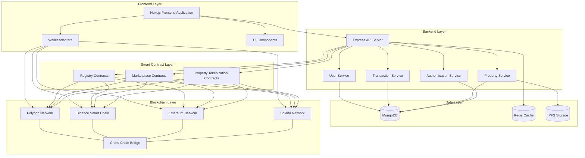

# YieldHabitat Technical Architecture

This document provides a detailed overview of the YieldHabitat platform's technical architecture.

## System Architecture Diagram

## Architecture Overview

YieldHabitat's architecture is organized into several distinct layers, each with specific responsibilities:

### Frontend Layer
- **Next.js Frontend Application**: Server-side rendered React application providing the user interface
- **Wallet Adapters**: Integration with multiple blockchain wallets across different networks
- **UI Components**: Reusable UI components for consistent user experience

### Backend Layer
- **Express API Server**: RESTful API server handling client requests
- **Authentication Service**: Handles wallet-based authentication and JWT token management
- **Property Service**: Manages property listings, metadata, and token information
- **Transaction Service**: Processes and tracks token purchases and transfers
- **User Service**: Handles user profiles, preferences, and KYC verification

### Data Layer
- **MongoDB**: Primary database storing user data, property information, and transactions
- **Redis Cache**: In-memory caching for improved performance
- **IPFS Storage**: Decentralized storage for property images and documents

### Blockchain Layer
- **Solana Network**: Primary blockchain for high-performance property tokenization
- **Ethereum Network**: Support for ERC-20 and ERC-721 token standards
- **Binance Smart Chain**: Low-fee alternative blockchain
- **Polygon Network**: Scalable solution for high-frequency transactions
- **Cross-Chain Bridge**: Custom bridge solution enabling token transfers between chains

### Smart Contract Layer
- **Property Tokenization Contracts**: Manage creation and distribution of property tokens
- **Marketplace Contracts**: Facilitate buying and selling of property tokens
- **Registry Contracts**: Maintain verified property records and compliance data

## Data Flow

1. Users interact with the frontend application through a web browser
2. The frontend communicates with the backend API for data retrieval and updates
3. The backend interacts with the database for persistent storage
4. Blockchain operations are initiated through the frontend wallet adapters
5. Smart contracts execute transactions on their respective blockchains
6. The cross-chain bridge enables token movement between different networks
7. The backend syncs with blockchain data to maintain consistent state

## Deployment Architecture

YieldHabitat is deployed using a containerized microservices architecture:

- Frontend is deployed as static assets through a CDN
- Backend services run as Docker containers orchestrated with Kubernetes
- Database instances are deployed as managed services
- Blockchain nodes connect to respective networks through dedicated RPC endpoints

## Security Architecture

Security is implemented at multiple levels:

- **Frontend**: HTTPS, CSP headers, input validation
- **Backend**: JWT authentication, rate limiting, input sanitization
- **Data**: Encryption at rest, access controls, regular backups
- **Blockchain**: Multi-signature wallets, formal verification, security audits

## Scalability Considerations

The architecture is designed to scale horizontally:

- Stateless backend services can be replicated across multiple instances
- Database sharding for increased data capacity
- Caching layer for reduced database load
- Load balancing across all service layers 